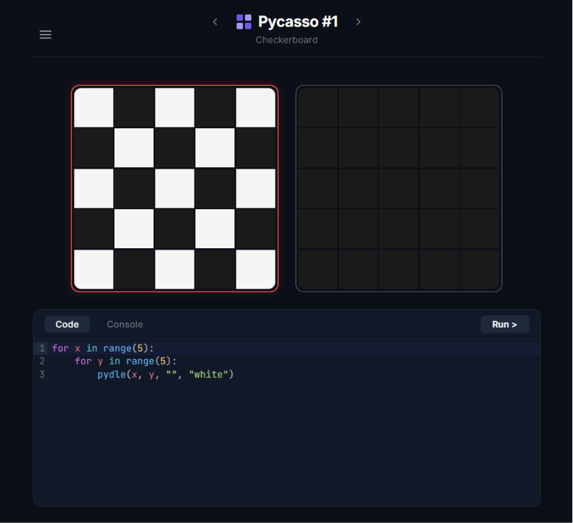

# PyCasso

<p align="center">
  
  
  
  
  
</p>

<p align="center">
PyCasso is a browser-based programming puzzle game where players recreate pixel art by writing Python. Instead of drawing directly, players write code that controls the canvas. Python executes entirely in the    browser using Pyodide, allowing puzzles to run locally without requiring a backend.
</p>

<p align = "center">
The project combines a React interface, an in-browser Python runtime, and a modular puzzle engine to create an interactive coding experience focused on learning through visual programming.
</p>

<p align="center">
  <a href="https://py-casso.vercel.app/"><strong>🌐 Try it live:</strong></a>
</p>

<p align="center">
  
</p>


---

## Execution flow

```text
Write Python
      │
      ▼
CodeMirror
      │
      ▼
Pyodide Runtime
      │
      ▼
Grid Engine
      │
      ▼
Canvas Update
      │
      ▼
Validation & Score
```

## Architecture

```text
                   User
                    │
                    ▼
        ┌─────────────────────┐
        │      React UI       │
        │  Components & State │
        └──────────┬──────────┘
                   │
                   ▼
        ┌─────────────────────┐
        │     CodeMirror      │
        │   Python Editor     │
        └──────────┬──────────┘
                   │
                   ▼
        ┌─────────────────────┐
        │       Pyodide       │
        │   Python Runtime    │
        │    (WebAssembly)    │
        └──────────┬──────────┘
                   │
                   ▼
        ┌─────────────────────┐
        │     Game Engine     │
        │  Validation & Logic │
        └──────────┬──────────┘
                   │
                   ▼
             Pixel Canvas
```

---

## Features

- Execute Python entirely in the browser with Pyodide
- Interactive pixel-art puzzles
- Live accuracy feedback
- Code editor powered by CodeMirror 6
- Puzzle validation with scoring
- Console output and runtime error reporting
- Progress persistence using browser storage

---

## Technologies

### Framework

- React 19
- TypeScript
- Vite

### Python Runtime

- **Pyodide** — https://pyodide.org/

The application loads the Pyodide runtime from the official CDN the first time Python code is executed. After initialization, the runtime is reused for subsequent executions to reduce startup overhead.

### Tooling

- ESLint
- Oxlint
- TypeScript Project References

---

## Directory overview

| Directory | Description |
|-----------|-------------|
| [`public/`](./public) | Static assets served directly by Vite |
| [`src/components/`](./src/components) | React components responsible for the editor, grids, dialogs, progress indicators, and navigation. |
| [`src/engine/`](./src/engine) | Puzzle definitions, validation, game logic, and the Pyodide execution layer |

## Core project files

| File | Responsibility |
|------|----------------|
| [`src/components/CodeEditor.tsx`](./src/components/CodeEditor.tsx) | Embedded CodeMirror editor and execution controls. |
| [`src/components/DualGridView.tsx`](./src/components/DualGridView.tsx) | Displays the target image beside the user's generated output. |
| [`src/components/GridDisplay.tsx`](./src/components/GridDisplay.tsx) | Renders the interactive pixel grid. |
| [`src/components/AccuracyBar.tsx`](./src/components/AccuracyBar.tsx) | Displays puzzle completion accuracy. |
| [`src/components/Header.tsx`](./src/components/Header.tsx) | Navigation and puzzle controls. |
| [`src/components/MenuModal.tsx`](./src/components/MenuModal.tsx) | Application menu and settings. |
| [`src/components/WinModal.tsx`](./src/components/WinModal.tsx) | Puzzle completion dialog. |
| [`src/engine/pyodideRunner.ts`](./src/engine/pyodideRunner.ts) | Loads Pyodide from the official CDN, initializes the runtime, and executes Python safely. |
| [`src/engine/gameLogic.ts`](./src/engine/gameLogic.ts) | Handles puzzle validation, scoring, and gameplay rules. |
| [`src/engine/puzzles.ts`](./src/engine/puzzles.ts) | Stores puzzle definitions and challenge data. |

---

## External libraries

| Library | Purpose |
|---------|---------|
| [Pyodide](https://pyodide.org/) | Browser-based CPython runtime built on WebAssembly |
| [CodeMirror 6](https://codemirror.net/) | Extensible code editor |
| [@uiw/react-codemirror](https://github.com/uiwjs/react-codemirror) | React integration for CodeMirror |
| [@codemirror/lang-python](https://github.com/codemirror/lang-python) | Python syntax highlighting |
| [@codemirror/theme-one-dark](https://github.com/codemirror/theme-one-dark) | One Dark editor theme |

---

## Project structure


```text
.
├── public/
├── src/
│   ├── components/
│   │   ├── AccuracyBar.tsx
│   │   ├── CodeEditor.tsx
│   │   ├── DualGridView.tsx
│   │   ├── GridDisplay.tsx
│   │   ├── GridIcons.tsx
│   │   ├── Header.tsx
│   │   ├── MenuModal.tsx
│   │   └── WinModal.tsx
│   │
│   ├── engine/
│   │   ├── gameLogic.ts
│   │   ├── puzzles.ts
│   │   └── pyodideRunner.ts
│   │
│   ├── App.tsx
│   ├── index.css
│   └── main.tsx
│
├── index.html
├── package.json
├── vite.config.ts
├── tsconfig.json
├── tsconfig.app.json
├── tsconfig.node.json
├── eslint.config.js
└── README.md
```

---

## Design principles

- **Local-first execution** — User programs run entirely inside the browser.
- **Modular architecture** — Runtime, puzzle logic, and UI remain independent.
- **Browser-native experience** — No backend is required for code execution.
- **Fast iteration** — The Python runtime is initialized once and reused throughout the session.

---

## Why PyCasso?

PyCasso demonstrates how modern web technologies can provide a complete Python programming environment without relying on server-side execution. By combining React, Pyodide, and a modular puzzle engine, the project delivers an interactive platform where users can write, execute, and debug Python while solving visual programming challenges.

The separation between the UI and the execution engine also makes the project straightforward to extend with additional puzzle types, game mechanics, or programming languages in the future.
